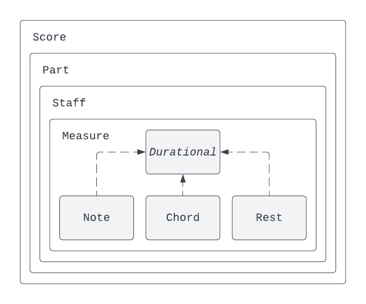
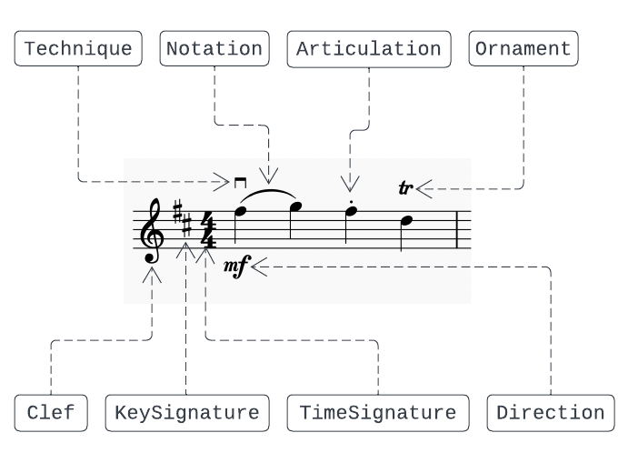

# Structure of scores in wmn4j

This document gives an overview of how scores are structured in wmn4j.
All score classes are immutable and thus inherently thread-safe.

## Containment hierarchy

The main class is `Score` which contains the rest of the _container_ classes.
A `Measure` can contain multiple _voices_, each of which consists of `Durational`
notation elements. There are three types of durationals:

- `Note`: a basic note that can have pitch.
- `Chord`: consists of multiple notes that occur simultaneously with the same duration.
- `Rest`: a simple rest.

## Measure-level types

The more detailed types that represent music notation are contained at the
measure-level. The types attached to notes are accessible through the interface of
the `Note` type, and the types that impact the whole measure or a larger part of it
are accessible through the `Measure` type.
